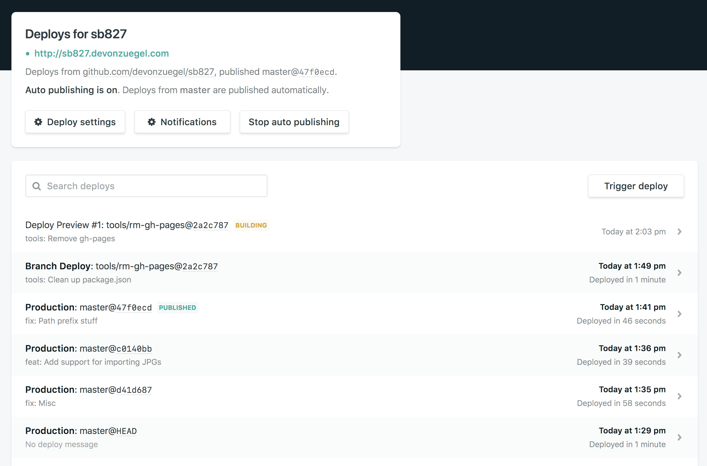
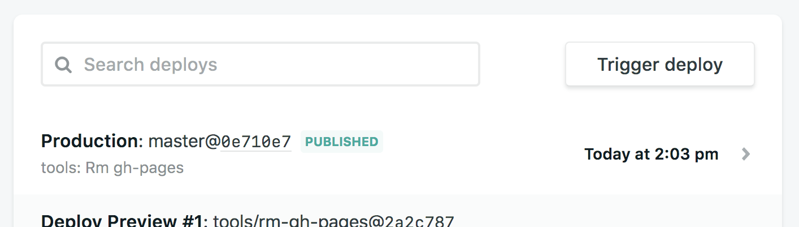

# SB 827

## Development

To develop locally with live reload:

```bash
yarn develop
```

## Deployment

The site is deployed at http://sb827.netlify.com.

1.  Checkout a new branch locally, commit any changes you want, then push it to GitHub.
2.  Netlify will create a deploy preview at a temporary url. Check it out here: https://app.netlify.com/sites/sb827/deploys. If your branch were named tools/rm-gh-pages, it would look something like: 
3.  Once the deploy preview looks good, merge that branch into master. Netlify will automatically deploy the site from changes to master: 

## Misc

This is based on the [default Gatsby starter](https://github.com/gatsbyjs/gatsby-starter-default) converted to [TypeScript](https://www.typescriptlang.org/).
